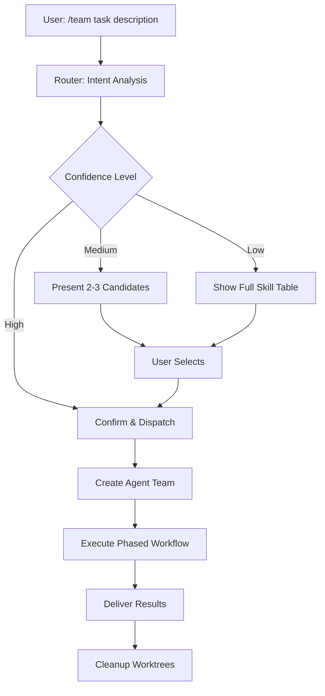
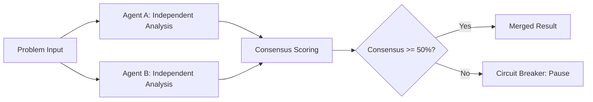

# claude-skills

A curated library of Claude Code multi-agent skills for intelligent team collaboration.

## Overview

**claude-skills** provides 16 specialized team-based skills plus 1 intelligent router that extend Claude Code's capabilities through multi-agent collaboration patterns. Each skill orchestrates a team of specialized agents that work together through phased workflows — from architecture analysis to incident response. Skills are pure Markdown files deployed via symlinks, requiring no build tools or dependencies.

## Features

- **17 ready-to-use skills** covering development, review, operations, research, and more
- **Intelligent routing** — describe your task in natural language; the router picks the right skill
- **Dual independent analysis** — two agents analyze problems separately, then merge via consensus scoring to eliminate anchor bias
- **Isolated git worktrees** — parallel conflict-free coding across multiple agents
- **Circuit breaker protection** — hard pause when consensus drops below 50% or iteration limits are exceeded
- **Streaming review pipeline** — review begins immediately as each task completes, no batch waiting
- **Autonomous mode** (`--auto`) — reduce confirmations while keeping hard gates for security and breaking changes
- **Bilingual support** — Chinese and English output (`--lang=zh|en`)
- **Zero dependencies** — pure Markdown + YAML, deployed via symlinks

## Skill Catalog

| Skill | Category | Description |
|-------|----------|-------------|
| `team` | Meta | Intelligent router — analyzes intent and dispatches to the right skill |
| `team-dev` | Development | Full development lifecycle: requirement → design → implement → review → test → ship |
| `team-debug` | Development | Systematic bug diagnosis: reproduce → dual root cause analysis → TDD fix → verify |
| `team-refactor` | Development | Atomic refactoring: impact analysis → dual plan → batch execution → verify |
| `team-perf` | Development | Performance analysis and optimization |
| `team-security` | Development | Security audit and vulnerability scanning |
| `team-review` | Review | Multi-dimensional code review with iterative fix cycles (max 5 rounds) |
| `team-arch` | Review | Architecture analysis with dual consensus |
| `team-rfc` | Review | Technical proposal writing with research and dual architecture input |
| `team-design-review` | Design | Design document evaluation |
| `team-api-design` | Design | API specification and design |
| `team-incident` | Operations | Production incident response with fast crisis triage |
| `team-postmortem` | Operations | Post-incident retrospective analysis |
| `team-release` | Operations | Release management with 5-dimensional risk scoring |
| `team-cost` | Operations | Cost optimization analysis |
| `team-research` | Research | Technology research and comparison (3-level search: local → web → deep read) |
| `team-onboard` | Research | Knowledge base and onboarding documentation generation |

## Quick Start

### 1. Clone the repository

```bash
git clone https://github.com/ketor/claude-skills.git
cd claude-skills
```

### 2. Create the skills directory

```bash
mkdir -p ~/.claude/skills
```

### 3. Symlink all skills

```bash
REPO_DIR=$(pwd)
for skill_dir in "$REPO_DIR"/team*/; do
  skill_name=$(basename "$skill_dir")
  ln -s "$skill_dir" "$HOME/.claude/skills/$skill_name"
done
```

### 4. Verify installation

```bash
ls -la ~/.claude/skills/
```

You should see symlinks for all 17 `team*` directories.

### 5. Start using skills

Open Claude Code and type:

```
/team describe your task here
```

## Usage

### Using the Router

The simplest way to use claude-skills is through the intelligent router:

```
/team add user authentication with JWT tokens
```

The router analyzes your intent, matches it to the best skill, and dispatches automatically. At high confidence it confirms and proceeds; at medium confidence it presents 2-3 candidates for you to choose; at low confidence it shows the full skill reference table.

### Calling a Skill Directly

You can bypass the router and invoke any skill directly:

```
/team-dev implement a REST API for user management
/team-debug the login page returns 500 after upgrading express
/team-review check the recent PR for security issues
/team-arch analyze the current microservice architecture
/team-release prepare v2.1.0 release
```

### Autonomous Mode

Add `--auto` to reduce interactive confirmations. Hard gates (security decisions, breaking changes) always require approval:

```
/team --auto refactor the payment module to use the new gateway
```

### Language Selection

Control output language with `--lang`:

```
/team --lang=en analyze production performance bottlenecks
/team --lang=zh 分析生产环境性能瓶颈
```

## Architecture

### Routing and Execution Flow



### Dual Independent Analysis Pattern



### Key Architecture Patterns

| Pattern | Description |
|---------|-------------|
| **Dual Independent Analysis** | Two agents analyze the same problem independently (no anchor bias), consensus scoring merges results |
| **Streaming Review Pipeline** | Review happens immediately as each task completes, not batch-wait |
| **Isolated Worktrees** | Each coder gets a dedicated git worktree for parallel conflict-free work |
| **Circuit Breaker** | Hard pause when consensus < 50% or iterations exceed limit |
| **Phase Checkpoints** | Explicit gates between phases for large-scale projects |
| **Root Cause Grouping** | Group symptoms by root cause, fix root once |

## Skill Details

### Development & Debugging

**team-dev** — Full Development Lifecycle
- Team: architect x2, coder x2, reviewer, tester
- Workflow: requirement → design → implement → review → test → ship
- Uses isolated worktrees for parallel coding

**team-debug** — Systematic Bug Diagnosis
- Team: reproducer, analyzer x2, fixer, verifier
- Workflow: reproduce → dual root cause analysis → TDD fix → verify
- Dual analysis eliminates single-perspective bias

**team-refactor** — Atomic Refactoring
- Team: analyzer, planner x2, coder, reviewer, tester
- Workflow: impact analysis → dual plan → batch execution → verify
- Phase checkpoints ensure safe incremental changes

**team-perf** — Performance Optimization
- Identifies bottlenecks and proposes targeted optimizations

**team-security** — Security Audit
- Scans for vulnerabilities and provides remediation guidance

### Review & Analysis

**team-review** — Multi-Dimensional Code Review
- Team: scanner, reviewer x2, fixer, tester
- Workflow: auto-scan → dual review → iterative fix cycles (max 5 rounds)
- Streaming pipeline: review begins as soon as scanning completes

**team-arch** — Architecture Analysis
- Team: scanner, analyzer x2, analyst, writer
- Dual consensus analysis of architectural patterns and trade-offs

**team-rfc** — Technical Proposal Writing
- Team: researcher, architect x2, reviewer, writer
- Research-backed proposals with dual architectural review

### Design & Planning

**team-design-review** — Design Document Evaluation
- Evaluates design documents for completeness, feasibility, and risks

**team-api-design** — API Specification and Design
- Produces API specifications following best practices

### Operations & Release

**team-incident** — Production Incident Response
- Crisis workflow with fast triage for rapid response
- Prioritizes mitigation over root cause during active incidents

**team-postmortem** — Post-Incident Retrospective
- Structured retrospective analysis with actionable follow-ups

**team-release** — Release Management
- Team: scanner, validator x2, writer, checker
- 5-dimensional risk scoring for release readiness assessment

**team-cost** — Cost Optimization
- Analyzes infrastructure and resource costs with optimization recommendations

### Research & Documentation

**team-research** — Technology Research
- 3-level search strategy: local → web → deep read
- Structured comparison and recommendation output

**team-onboard** — Onboarding Documentation
- Generates knowledge base and onboarding guides from codebase analysis

## Parameters Reference

### Global Parameters

| Parameter | Values | Default | Description |
|-----------|--------|---------|-------------|
| `--auto` | flag | off | Autonomous mode: skip non-critical confirmations |
| `--lang` | `zh`, `en` | `zh` | Output language |

### Skill-Specific Parameters

| Parameter | Description | Used By |
|-----------|-------------|---------|
| `--depth` | Analysis depth level | `team-arch`, `team-review`, `team-research` |
| `--focus` | Area of focus | `team-perf`, `team-security`, `team-review` |
| `--scope` | Scope of analysis | `team-refactor`, `team-arch` |
| `--severity` | Severity threshold | `team-incident`, `team-security` |
| `--type` | Specific sub-type | `team-rfc`, `team-release` |

Parameters are passed through the router to the target skill:

```
/team --auto --lang=en --depth=deep analyze the authentication architecture
```

## Development

### Skill File Structure

Each skill lives in its own directory containing a `SKILL.md` file with YAML frontmatter:

```
team-example/
  SKILL.md
```

The `SKILL.md` file defines:
- **Frontmatter**: skill name, description, metadata
- **Team composition**: agent roles and responsibilities
- **Workflow phases**: ordered steps with entry/exit criteria
- **Output format**: expected deliverables

### Creating a New Skill

1. Create a new directory: `mkdir team-yourskill`
2. Write `team-yourskill/SKILL.md` with YAML frontmatter and workflow definition
3. Symlink to skills directory: `ln -s $(pwd)/team-yourskill ~/.claude/skills/team-yourskill`
4. Test with: `/team-yourskill your test task`
5. Optionally add router keywords in the `team/SKILL.md` intent-matching section

### Testing with Evals

The project includes an evaluation suite at `team-workspace/evals/evals.json` with 20 test cases across these categories:

| Category | Description |
|----------|-------------|
| `clear-match` | Unambiguous intent that maps directly to one skill |
| `edge-case` | Boundary cases between similar skills |
| `urgent-priority` | Tasks with urgency signals that should affect routing |
| `ambiguous-urgent` | Ambiguous intent combined with urgency markers |

## Project Structure

```
claude-skills/
├── team/                  # Intelligent router skill
│   └── SKILL.md
├── team-dev/              # Development lifecycle
│   └── SKILL.md
├── team-debug/            # Bug diagnosis
│   └── SKILL.md
├── team-refactor/         # Code refactoring
│   └── SKILL.md
├── team-perf/             # Performance optimization
│   └── SKILL.md
├── team-security/         # Security audit
│   └── SKILL.md
├── team-review/           # Code review
│   └── SKILL.md
├── team-arch/             # Architecture analysis
│   └── SKILL.md
├── team-rfc/              # Technical proposals
│   └── SKILL.md
├── team-design-review/    # Design evaluation
│   └── SKILL.md
├── team-api-design/       # API design
│   └── SKILL.md
├── team-incident/         # Incident response
│   └── SKILL.md
├── team-postmortem/       # Post-incident review
│   └── SKILL.md
├── team-release/          # Release management
│   └── SKILL.md
├── team-cost/             # Cost optimization
│   └── SKILL.md
├── team-research/         # Technology research
│   └── SKILL.md
├── team-onboard/          # Onboarding docs
│   └── SKILL.md
└── team-workspace/
    └── evals/
        └── evals.json     # Evaluation test suite
```

## Contributing

1. Fork the repository
2. Create a feature branch: `git checkout -b feat/your-skill-name`
3. Add your skill following the structure in [Development](#development)
4. Test locally via symlink
5. Submit a pull request with a description of the skill's purpose and workflow

When contributing a new skill:
- Follow the existing naming convention: `team-<verb-or-domain>`
- Include clear team composition with agent roles
- Define explicit workflow phases with entry/exit criteria
- Consider adding dual analysis where independent perspectives add value
- Add corresponding test cases to the eval suite

## License

This project is open source. See the repository for license details.
