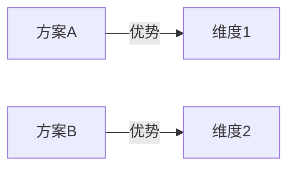

**参数解析**：从 `$ARGUMENTS` 中检测以下标志：
- `--auto`：自主模式（减少用户确认）
- `--depth=quick|standard|deep`：调研深度（默认 `standard`）
- `--lang=zh|en`：报告语言（默认 `zh` 中文）

| 模式 | 用户确认范围 | 条件节点处理 |
|------|-------------|-------------|
| **标准模式**（默认） | 主题确认 + 分歧仲裁 + 最终报告确认 | 正常询问用户 |
| **自主模式**（`--auto`） | 仅最终报告确认 | 自动决策 + 收尾汇总 |

自主模式下条件节点自动决策规则：
- **主题范围不确定** → team lead 自行界定范围，在最终报告中说明
- **两位 researcher 分歧** → writer 合并时标注分歧，team lead 综合论证后裁决，收尾时汇总
- **分歧超过 50%** → **不可跳过，必须暂停问用户**（熔断机制）
- **两位 researcher 均报告"网络信息不足"** → **不可跳过，必须暂停问用户调整主题/关键词**（熔断机制）

调研深度说明：

| 深度 | 调研范围 |
|------|---------|
| `quick` | 快速概览，仅搜索网络热门结果，本地文档粗扫 |
| `standard` | 多轮搜索 + 本地文档细读，交叉验证信息 |
| `deep` | 全面调研，额外包括学术文献、竞品对比、趋势预测 |

使用 TeamCreate 创建 team（名称格式 `team-research-{YYYYMMDD-HHmmss}`），你作为 team lead 按以下流程协调。

## 流程概览

```
阶段零  主题解析 → team lead 解析调研主题 → 提取关键词和调研维度
         ↓
阶段一  并行调研 → researcher-1（广度优先）+ researcher-2（深度优先）独立调研
         ↓
阶段二  共识合并 → writer 对比两份报告 → 标注一致/分歧/互补 → 生成初稿
         ↓
阶段三  分歧仲裁 → team lead 对分歧点让两位 researcher 各自论证 → 仲裁
         ↓
阶段四  报告生成 → writer 生成最终 Markdown + Mermaid 图表 → 用户确认
         ↓
阶段五  收尾 → 保存报告 + 清理团队
```

## 角色定义

| 角色 | 职责 |
|------|------|
| researcher-1 | 围绕调研主题进行独立调研：网络搜索（WebSearch/WebFetch）+ 本地文档分析（Read/Glob/Grep）。**广度优先策略**：多组关键词、多角度搜索，覆盖面广。输出结构化调研报告。**独立工作，不与 researcher-2 交流。** |
| researcher-2 | 同 researcher-1 的职责，独立执行相同调研。**深度优先策略**：少量精准关键词、对重点来源深入阅读分析。输出结构化调研报告。**独立工作，不与 researcher-1 交流。** |
| writer | 对比两位 researcher 的调研报告，标注一致和分歧之处，合并信息来源，生成 Mermaid 图表，撰写最终调研报告。**不自行搜索或阅读原始资料，只基于调研报告工作。** 当两份报告存在根本性矛盾时，必须标注为"待仲裁"并升级给 team lead，不得自行裁决。 |

---

## 阶段零：主题解析

### 步骤 1：解析调研主题

Team lead 解析 `$ARGUMENTS` 中的调研主题：
- 提取核心关键词和搜索方向
- 拆分调研维度（如技术对比则拆分为"方案 A 特性、方案 B 特性、对比维度"）
- 检查本地工作目录是否有相关文档（扫描当前目录和 `~/Documents`）
- 确定报告语言（`--lang` 参数或默认中文）

### 步骤 2：确认调研范围

- 如果主题明确 → 直接进入阶段一
- 如果主题模糊或过于宽泛：
  - **标准模式**：用 AskUserQuestion 让用户明确范围、关注重点
  - **自主模式**：team lead 自行界定范围，收尾时说明

---

## 阶段一：并行调研

### 步骤 3：启动 researcher-1 和 researcher-2

两者并行启动，全程保持存活直到收尾。

**Researcher-1（广度优先）**：
- 3-5 组不同关键词搜索（WebSearch），覆盖不同角度和子主题
- 粗扫本地文档目录，识别相关文件列表
- 对搜索结果中的关键页面用 WebFetch 获取详细内容（选取 3-5 个最相关页面）
- 每个信息来源标注 URL 或文件路径
- 输出：发现列表 + 来源索引 + 关键摘要

**Researcher-2（深度优先）**：
- 1-2 组精准关键词搜索
- 对搜索结果中的重点页面深入阅读（WebFetch 全文提取，选取 2-3 个核心页面逐段分析）
- 深入分析本地相关文档（Read 全文阅读）
- 每个信息来源标注 URL 或文件路径
- 输出：深度分析报告 + 来源索引 + 详细论述

**搜索终止条件**：每位 researcher 单次搜索如果返回无关结果，调整关键词重试，单个方向最多重试 3 轮。3 轮后仍无结果则标注"该方向网络信息不足"并继续其他方向。

`deep` 模式额外调研：
- 学术文献搜索（Google Scholar 等）
- 竞品/替代方案对比
- 行业趋势和发展预测

### 步骤 4：收集报告

两者完成后各自向 team lead 发送报告。Team lead 确认收到全部 2 份报告后，进入阶段二。

---

## 阶段二：共识合并

### 步骤 5：启动 writer 进行对比合并

Team lead 启动 writer，将以下内容传递给 writer：
- Researcher-1 的调研报告（标记为"研究员 A"）
- Researcher-2 的调研报告（标记为"研究员 B"）

**重要**：传递时不透露 researcher 编号，仅用"研究员 A"和"研究员 B"标记，避免暗示优先级。

### 步骤 6：Writer 对比分析

Writer 逐项对比两份调研报告，按以下规则处理：

| 对比结果 | 处理方式 |
|---------|---------|
| **一致结论** | 直接采纳，标记为"共识" |
| **互补发现**（A 发现了 B 没注意的点，或反之） | 合并，标记为"互补" |
| **措辞/粒度差异**（本质相同，表述不同） | 合并最佳表述，标记为"共识" |
| **分歧/矛盾**（对同一问题有不同结论） | 标注为"待仲裁"，记录双方观点和来源 |

Writer 输出：
1. **合并初稿**：整合所有共识和互补发现的调研报告草稿
2. **共识度评估**：共识度 = (共识发现数 + 互补发现数) / 总发现数(去重并集) × 100%
3. **分歧清单**：每个分歧点的双方观点和来源对比

### 步骤 7：检查熔断条件

如果共识度 < 50%（分歧占比超过一半）：
- **必须暂停**，team lead 向用户报告情况
- 可能原因：主题理解有偏差、搜索方向不同、主题过于宽泛
- 建议：明确调研范围或拆分子主题

共识度 ≥ 50%：继续下一阶段。

---

## 阶段三：分歧仲裁

### 步骤 8：判断是否需要仲裁

如果分歧清单为空 → 跳过此阶段，直接进入阶段四。

### 步骤 9：逐项仲裁

Team lead 对分歧清单中的每个分歧点：

1. 将分歧描述分别发给 researcher-1 和 researcher-2，要求各自提供论证：
   - 你的结论是什么？
   - 依据哪些来源（附 URL/路径）？
   - 为什么你认为对方的结论不准确？

2. 收到双方论证后：
   - **标准模式**：team lead 向用户展示分歧摘要和双方论证，AskUserQuestion 让用户裁决
   - **自主模式**：team lead 综合双方论证和来源可信度自行裁决

3. 将仲裁结果发送给 writer 更新报告

### 步骤 10：更新初稿

Writer 根据仲裁结果更新合并初稿，将所有"待仲裁"项替换为最终结论。在报告附录中保留分歧记录和仲裁理由。

---

## 阶段四：报告生成

### 步骤 11：Writer 生成最终报告

Writer 基于合并后的调研结果，按 `--lang` 参数指定的语言生成最终调研报告。文档格式：

```markdown
# [调研主题] 调研报告

> 生成时间：YYYY-MM-DD | 调研深度：quick|standard|deep | 共识度：XX%

## 1. 摘要
[200-300 字的调研主题概述和核心结论]

## 2. 背景
[主题的背景知识、历史沿革、行业/技术现状]

## 3. 核心发现

### 3.1 [维度/子主题 1]
[详细分析]

### 3.2 [维度/子主题 2]
[详细分析]

## 4. 对比分析（如适用）

| 维度 | 方案 A | 方案 B | 方案 C |
|------|--------|--------|--------|
| [维度] | [评价] | [评价] | [评价] |



## 5. 趋势与展望（standard/deep 模式）
[行业趋势、技术发展方向、预测]

## 6. 结论与建议
1. [核心结论 1]
2. [核心结论 2]
3. [行动建议]

## 7. 参考来源
| 序号 | 来源 | 类型 | URL/路径 |
|------|------|------|---------|
| 1 | [来源名] | 网络/本地 | [链接] |

## 附录：调研共识说明

### 共识结论
[两位研究员一致的核心结论列表]

### 分歧点及仲裁结果
| 分歧点 | 研究员 A 观点 | 研究员 B 观点 | 仲裁结果 | 理由 |
|--------|-------------|-------------|---------|------|
| [描述] | [观点] | [观点] | [结论] | [理由] |
```

**注意**：每张 Mermaid 图不超过 15 个节点。如果内容复杂，分多张图展示。

### 步骤 12：用户确认

Team lead 向用户展示报告摘要：
- 调研主题和范围
- 核心结论（3-5 条）
- 共识度
- 分歧数量及处理结果
- 参考来源数量

AskUserQuestion 确认：
- 接受报告
- 需要补充某些方面的调研
- 需要调整某些结论

**自主模式**：必须经用户确认。

---

## 阶段五：收尾

### 步骤 13：保存报告

将最终调研报告保存到项目的 `docs/research/` 目录：
- 文件名：`research-YYYY-MM-DD-<topic>.md`
- 如果目录不存在，创建之

### 步骤 14：最终总结

Team lead 向用户输出：
- 调研了什么（主题、范围、深度）
- 核心发现摘要
- 共识度和分歧处理情况
- 报告保存位置
- **（自主模式）自动决策汇总**：列出所有自动决策的节点、决策内容和理由

### 步骤 15：清理

关闭所有 teammate，用 TeamDelete 清理 team。

---

## 核心原则

- **独立调研**：两位 researcher 必须完全独立工作，不互相看到对方结果，确保共识的客观性
- **来源标注**：所有信息必须标注来源（URL 或文件路径），无来源的信息不采纳
- **广深互补**：researcher-1 广度优先，researcher-2 深度优先，搜索策略互补
- **共识驱动**：通过独立调研后的对比合并确保调研准确性，分歧必须仲裁
- **有限调研**：根据 depth 参数控制调研范围，避免无限发散

---

## 错误处理

| 异常情况 | 处理方式 |
|---------|---------|
| 主题过于宽泛 | Team lead 拆分为具体子主题，标准模式请用户确认 |
| 网络搜索无有效结果 | Researcher 调整关键词重试，最多 3 轮；仍无结果标注"网络信息不足" |
| 本地无相关文档 | Researcher 标注"无本地资料"，仅基于网络信息 |
| 两位 researcher 调研差异极大（共识度 < 50%） | 触发熔断，暂停问用户确认调研方向 |
| WebFetch 目标页面无法访问 | Researcher 跳过该来源，标注为"无法访问" |
| 信息来源相互矛盾 | Writer 在报告中标注矛盾，列出各方观点和来源 |
| 搜索结果主要为非目标语言 | Researcher 尝试添加语言限定关键词重新搜索 |

---

## 需求

$ARGUMENTS
